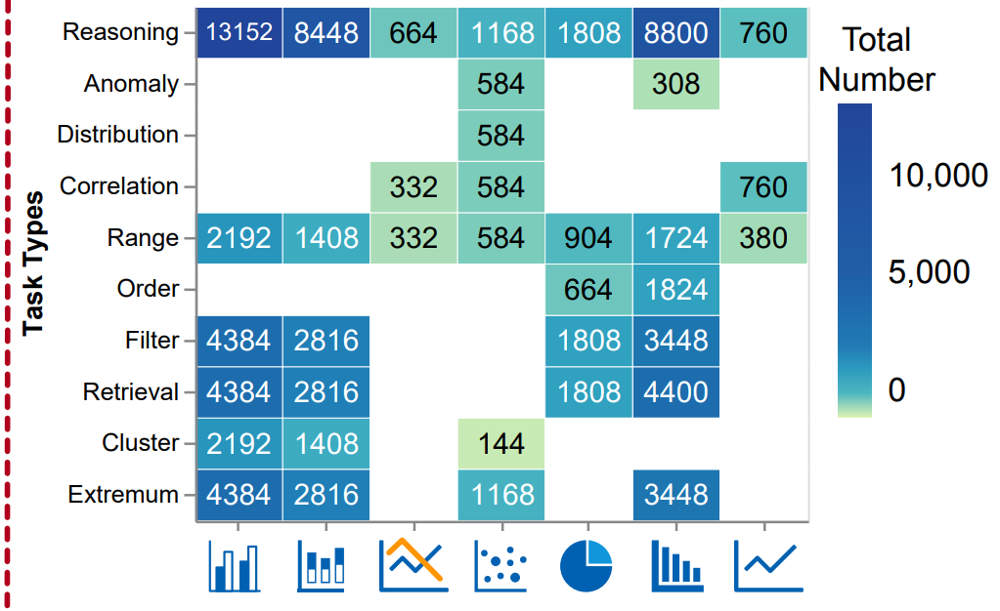
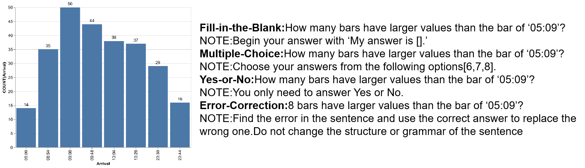
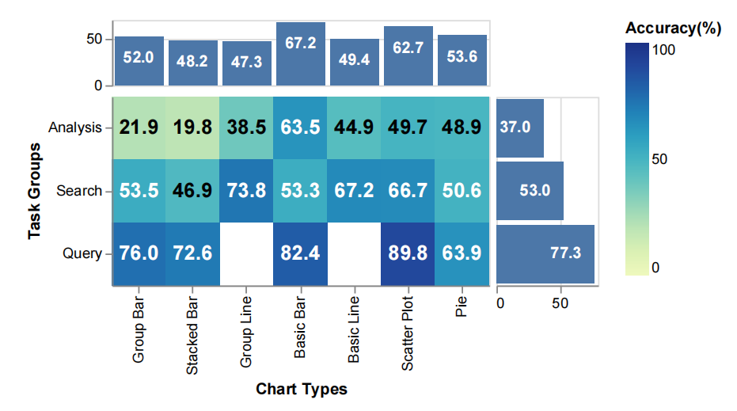
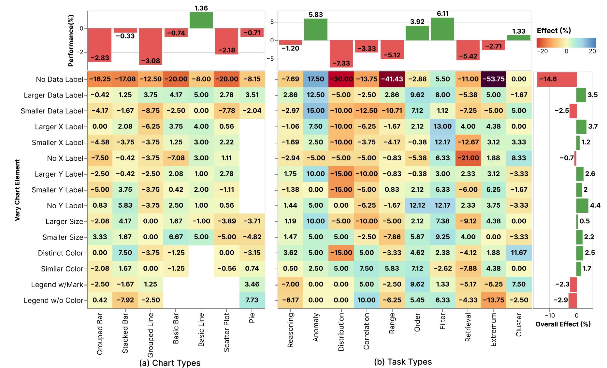
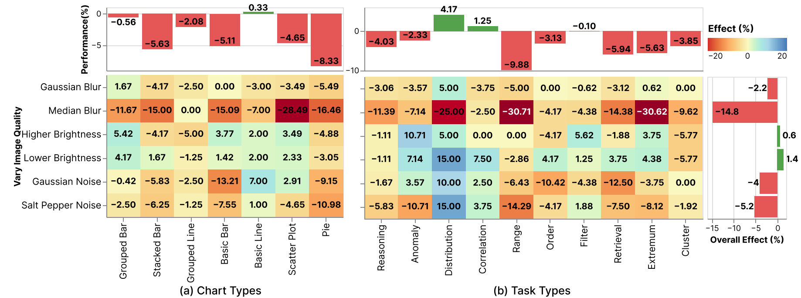
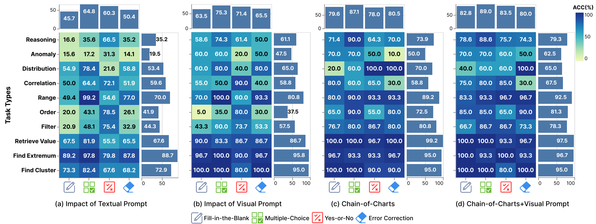

# Evaluating Task-based Effectiveness of MLLMs(especially GPT4-V) on Charts
- 🥳[About ChartsInsights](README.md)
    - [Scale of ChartInsights](README.md)
    - [10 Low-Level analysis tasks](README.md)
    - [Distribution of 7 charts on 10 tasks](README.md)
    - [Pipeline for Dataset Construction](README.md)
- 🎮[Dataset Examples](README.md)
- 📊[Evaluations on ChartInsights](README.md)
    - [Evaluation Set](README.md)
    - [Vary the Chart Elements](README.md)
    - [Vary the Chart Quality](README.md)
    - [Three types of Visual Prompts and Chain-of-Thought](README.md)
- 📊[Evaluation Scripts on ChartInsights with GPT-4V](README.md)
- 🧪[Evaluations Results](README.md)
    - [overall evaluation results](README.md)
    - [vary chart element results](README.md)
    - [vary chart quality results](README.md)
    - [Visual prompt and Chain-of-Charts](README.md)
- ⭐[Leaderboard](README.md)
    - [How to contribute to the leaderboard](README.md)
    - [Results of advanced MLLMs on ChartInsights](README.md)


## About ChartInsights
In this paper, we aim to systematically investigate the capabilities of GPT-4V in addressing 10 low-level data analysis tasks. Our study seeks to answer the following critical questions, shedding light on the potential of MLLMs in performing detailed, granular analyses.

__Q1__: Impact of Textual Prompt Variations. What is the impact of
different textual prompts on GPT-4V ’s output accuracy? This
question aims to assess the baseline performance and capabilities
of GPT-4V in different low-level tasks.

__Q2__: Impact of Visual Variations and Visual Prompts: How do
different visual prompts, such as alterations in color schemes,
layout configurations (e.g., aspect ratio), and image quality, affect
the performance of GPT-4V in low-level tasks?

__Q3__: Impact of Chain-of-Thoughts. Can we enhance basic textual
prompts in Q1 with a chain-of-thoughts like approach?

__Q4__: Synergistic Effect of Visual and Textual Prompts: Can the
combination of visual and textual prompts lead to enhanced performance in low-level ChartQA tasks with GPT-4V? This question explores the potential for achieving better results by integrating both types of prompts.
### Scale of ChartInsights
The ChartInsights dataset contains 89,388 (chart, task, query, answer)
ChartQA samples across 7 chart types for 10 low-level data analysis
tasks on charts. The Donut chart shows the proportion of 10 low-level tasks
(3 task groups) in ChartInsights. Among them, the analysis task group
is the largest, accounting for 42.46%. This task group examines the
reasoning power of multi-modal large models on charts. The heatmap
shows the distribution of 10 low-level tasks and 7 chart types.
### Donut chart showing the distribution of 10 low-level tasks
<div align=center>

</div>


### Heatmap for showing the distribution of 7 charts on 10 tasks
<div align=center>

</div>


### Pipeline for dataset construction
<div align=center>

</div>

## Dataset Examples
<div align=center>

</div>

## Evaluation on ChartInsights
**We conducted a total of four sets of evaluations on GPT-4V.**

- The first set of evaluations was a general assessment of GPT-4V's performance, utilizing the test dataset from ChartInsights.

    You can get the test set in the [overall directory](/overall). The relevant annotations and qa_pairs are all available. This set contains 400 pictures and 17552 questions in total, covering all 10 low-level analysis tasks and 7 charts from different categories.


- The second set of evaluations involved altering 15 types of chart elements.

    You can get altered images in [Vary Chart Element directory](https://github.com/Evanwu1125/ChartInsights/tree/main/evaluations/Vary%20Chart%20Element). This set contains 356 visual variants and 17972 corresponding qa_pairs, covering all 10 low-level analysis tasks and 7 charts from different categories.

- The third set of evaluations introduced 6 noise into the images. 

    You can get noised images in [Vary Chart Quality](https://github.com/Evanwu1125/ChartInsights/tree/main/evaluations/Vary%20Image%20Quality). This set contains 245 visual variants and 8456 corresponding qa_pairs, covering all 10 low-level analysis tasks and 7 charts from different categories.

  
- The fourth set of evaluations incorporated the addition of visual prompts and the design of Chain-of-Charts to the images.

    You can get visual-prompted images in [Three Types of Visual Prompt](https://github.com/Evanwu1125/ChartInsights/tree/main/evaluations/Three%20Types%20of%20Visual%20Prompt). This set contains 255 visual variants and 1020 corresponding qa_pairs, covering all 10 low-level analysis tasks and 7 charts from different categories.

## Evaluation scripts on ChartInsights with GPT-4V
You can find an example of evaluation code [here](example.ipynb). Before you start, remember to use your own Openai API KEY.
```python
api_key = 'YOUR API KEY'
```
## Evaluation Results
### Overall evaluation results
<div align=center>

</div>

### vary chart element results
<div align=center>

</div>

### vary chart quality results
<div align=center>

</div>

### visual prompt and chain-of-charts
<div align=center>

</div>

## Leaderboard
### Evaluation Pipeline and how to contribute to the leaderboard

- requirement

```
├── test_qa_pairs.json
├── test_annotations.json
├── images
    ├── 1.jpg
    ├── 2.jpg
    └── ...
```
- Response Generation
    The first set of evaluations was a general assessment of MLLM's performance, utilizing the test dataset from ChartInsights. Take GPT-4V as example, run the [Response Generation Template](/Response_Generation_Template.ipynb) and get a result collection like [Model_Response file](/Model_Response_Template.json)

- Accuracy Calculation
    With the [Model_Response file](/Result_Template.json), in this format, run [Accuracy Calculation](/Accuracy_Calculation/_main_.py). Finally,  you can get [6 csv file](/Accuracy_Table/) containing details about test result.

- Output

```
├── Model_Response.json
├── Accuracy Table
    ├── Overall_chart_accuracy.csv
    ├── Overall_task_accuracy.csv
    ├── Overall_question_accuracy.csv
    ├── Chart2Task_accuracy.csv
    ├── Question2Task_accuracy.csv
    └── Chart2Question_accuracy.csv
```
Feel free to use ChartInsights to benchmark your models and send the results to [this email](https://github.com/Evanwu1125) as feedback to help us upgrade the leaderboard continuously!
### Results of advanced MLLMs on ChartInsights
| Overall  | Model                | Reasoning | Anomaly | Distribution | Correlation | Range | Order | Filter | Retrieval | Extreme | Cluster |
|----------|----------------------|----------|-----------|---------|-------------|-------------|-------|-------|--------|-----------|--------|
| 🥇56.13    | GPT-4V               | 35.17    | 19.53     | 53.43   | 59.62       | 70.04       | 41.92 | 44.32 | 67.59  | 88.66     | 72.87  | 56.13   |
| 🥈51.655   | qwen-vl-max          | 28.84    | 25.78     | 62.25   | 62.98       | 66.12       | 40.19 | 38.86 | 66.99  | 79.64     | 66.76  | 51.655  |
| 🥉49.545   | Claude3(Haiku)       | 33.04    | 8.98      | 42.65   | 46.15       | 60.44       | 26.15 | 39.96 | 62.3   | 75.08     | 66.76  | 49.545  |
| 48.4375  | ChatGLM-4V           | 34.07    | 28.91     | 39.22   | 42.31       | 55.5        | 18.85 | 43.41 | 58.08  | 69.31     | 71.43  | 48.4375 |
| 48.36    | Gemini_pro           | 25.6     | 30.08     | 45.59   | 58.65       | 75.26       | 32.88 | 30.06 | 60.37  | 80.88     | 55.26  | 48.36   |
| 42.595   | qwen-vl-plus         | 30.77    | 27.34     | 47.06   | 47.12       | 42.95       | 34.62 | 20.72 | 58.69  | 65.52     | 62.5   | 42.595  |
| 40.2325  | Sphinx-v2           | 30.02    | 28.91     | 37.75   | 36.06       | 25.78       | 23.46 | 36.74 | 49.72  | 66.31     | 45.31  | 40.2325 |
| 38.51    | LLava-NEXT           | 30.6     | 7.42      | 26.47   | 37.98       | 29.5        | 33.27 | 23.39 | 53.49  | 59.81     | 52.27  | 38.51   |
| 33.295   | mPLUG-Owl2          | 30.99    | 26.95     | 29.41   | 35.34       | 28.39       | 22.5  | 40.25 | 30.89  | 41.1      | 27.27  | 33.295  |
| 33.425   | qwen-VL-chat         | 27.78    | 36.33     | 45.1    | 55.77       | 33.75       | 20    | 28.69 | 31.25  | 50.21     | 27.13  | 33.425  |
| 33.7525  | llava_vip            | 28.77    | 6.64      | 34.8    | 30.29       | 21.87       | 35.77 | 40.42 | 42.19  | 38.29     | 33.81  | 33.7525 |
| 32.3875  | ChartAssistant       | 24.58    | 27.73     | 35.78   | 28.12       | 30.48       | 22.5  | 14.66 | 39.38  | 63.04     | 26.42  | 32.3875 |
| 32.1875  | llava1.5             | 32.39    | 6.25      | 30.88   | 23.08       | 21.74       | 32.69 | 35.55 | 32.57  | 35.76     | 43.47  | 32.1875 |
| 31.055   | OmniLMM-12B          | 24.67    | 19.92     | 26.96   | 34.86       | 35.7        | 28.27 | 29.96 | 33.01  | 39.94     | 33.1   | 31.055  |
| 33.015   | MiniCPM-v2           | 19.54    | 55.08     | 33.33   | 56.49       | 24.87       | 16.73 | 36.31 | 37.94  | 52.4      | 31.96  | 33.015  |
| 29.4325  | cogvlm               | 20.32    | 23.05     | 43.63   | 29.57       | 37.73       | 10.77 | 9.07  | 37.86  | 56.62     | 26.7   | 29.4325 |
| 28.305   | Blip2                | 24.8     | 23.44     | 25      | 15.14       | 25.33       | 20.19 | 39.83 | 27.8   | 30.26     | 30.11  | 28.305  |
| 26.1875  | VisCPM               | 28.44    | 46.09     | 33.33   | 51.92       | 22.98       | 6.35  | 25.13 | 15.75  | 32        | 29.55  | 26.1875 |

